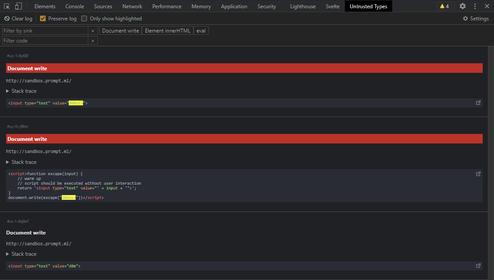

# Untrusted Types for DevTools
Untrusted Types is a Chrome extension that abuses [Trusted Types](https://w3c.github.io/webappsec-trusted-types/dist/spec/) to log DOMXSS sinks. 

## Installation
1. `npm i`
2. `npm run build`
3. Go to `chrome://extensions`, enable Developer mode
4. `Load unpacked`, choose the `public` folder

## Usage
Discover and test inputs passed into sinks that could lead to DOM XSS vulnerabilities.

A sink is a code pattern that could run arbitrary JavaScript code if the input is malicious, for example: `innerHTML`, `eval`, `document.write`.

Keywords (by default `d0mxss`) that are found to be passed in a sink will be highlighted in the extension and in the console.

A simple tutorial: https://www.youtube.com/watch?v=CNNCCgDkt5k

To find the stack trace of a specific log:
1. Copy the ID by clicking on it,
2. Open Console>Filter and paste the ID,
3. Now you can inspect the stack trace. Click on the function name to open it in the Sources tab.

----

The [original version](https://github.com/filedescriptor/untrusted-types/tree/old) was made by [filedescriptor](https://github.com/filedescriptor). This version extends it by adding a DevTools panel that allows for easier filtering/searching of found sinks. 

## Settings
You can edit settings directly in the extension:

## Limitation & Known Issues
1. While it covers a majority of sinks, it doesn't cover navigation sinks like `location = user_input` unless it's `location = 'javascript:' + user_input`. 
2. It doesn't work in websites that are already using Trusted Types. This is not a problem for now because even Google themselves don't use it a lot
3. If console logs are not showing the stack trace, refresh the page.
4. It will fail on web pages with `<iframe src="javascript:...">` (but fine if dynamically inserted). Check [issue #1](https://github.com/filedescriptor/untrusted-types/issues/1)

## Based on
- [untrusted-types](https://github.com/filedescriptor/untrusted-types/tree/old)
- [chrome-extension-svelte-typescript-boilerplate](https://github.com/NekitCorp/chrome-extension-svelte-typescript-boilerplate)
